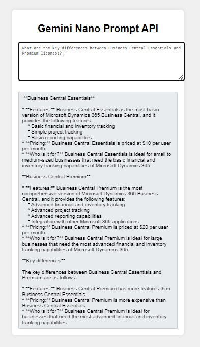

# GeminiNanoLocal

Welcome to the GeminiNanoLocal project! This application demonstrates how to interact with the Gemini Nano AI model in a web environment. Users can input text and receive real-time responses from the AI model, making the experience interactive and dynamic.

## Features

- **Real-time AI Response:** Get instant feedback from the AI as you type.
- **Simple Interface:** Easy-to-use interface for seamless interaction.
- **Local Execution:** Runs locally in your browser for quick and efficient responses.

## Getting Started

### Prerequisites

Ensure you have the following:

- **Google Chrome** (Version 127.0.6512.0 or above)
- **Gemini Nano and Prompt API flags** enabled in Chrome

To access and configure Gemini Nano on your local PC, follow the instructions provided by [Google Chrome Developers](https://developer.chrome.com/docs/ai/built-in). You will need to request access to a Google Group that contains the "Built-in AI Early Preview Program" document, which details all the necessary configurations.

### Installation

1. **Clone the repository:**

   ```bash
   git clone https://github.com/ivanrlg/GeminiNanoLocal.git
   ```

2. **Navigate to the project directory:**

   ```bash
   cd GeminiNanoLocal
   ```

3. **Open `index.html` in Google Chrome.**

### How It Works

The project leverages JavaScript to connect with the Gemini Nano AI model through the Prompt API. As you type your queries in the text area, the application sends these queries to the AI model and receives responses in real-time. This interaction is handled using the `promptStreaming` method, ensuring that responses are displayed dynamically as they are generated.

### Usage

1. **Type your question** in the provided text area.
2. **Receive responses** in real-time as you type.

### Project Structure

```
GeminiNanoLocal/
├── .gitignore
├── README.md
├── index.html
├── styles.css
├── script.js
└── assets/
    └── images/
        └── example_response.png
```

### Technologies Used

- **HTML**
- **CSS**
- **JavaScript**
- **Google Chrome**

### Example

Below is an example of a query about Business Central licenses and the response generated by the AI model:



## Contribution

Contributions to this project are welcome! If you have suggestions for improvements or have found issues, please follow our Contribution Guidelines. Feel free to fork the repository and submit pull requests.

## License

This project is available under the MIT License - see the [LICENSE](LICENSE.md) file for details.

## Acknowledgements

- **Google Chrome Team** for providing the Gemini Nano and Prompt API.
- **OpenAI** for inspiring AI-based projects.

---

*Happy coding!*
